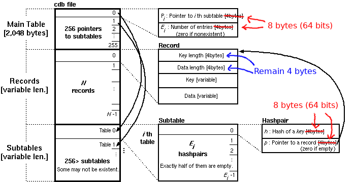

# node-constant-db [](https://travis-ci.org/ozomer/node-cdb-64)
A [cdb](http://cr.yp.to/cdb.html) implementation in node.js, supporting both read and write capabilities, using 64bit pointers and es6 features.


###### Original image from: http://www.unixuser.org/~euske/doc/cdbinternals/index.html
Notice that the pointers were increased to 64 bits to allow larger database.
The hash-size also supports 64 bits - [cdb's default hash-function](http://cr.yp.to/cdb/cdb.txt) gives results of 32 bits, but other hash functions could be used instead.
Key-Length and Data-Length remain 4 bytes (32 bits) - this allows only 4GB for each key and each value, but saves space if the database contains lots of short key-value pairs (which is the typical use-case).


## Installation
`npm install constant-db64`

## Changes from original v2.0.0
* Replacing error-first-callbacks with promises using async-await
* Writable is not an EventEmitter
* Using `getIterator()` instead of `getNext()`
* Using 64 bits for pointers and hash-values

## Changes from v1.0.0
* Renamed `getRecord()` to `get()`
* Renamed `putRecord()` to `put()`
* Added `getNext()`
* Dropped promise support
* Completely rewritten! `get()` calls should be much faster.

## Example
Writable cdb:
```javascript
var writable = require('constant-db').writable;

var writer = new writable('./cdbfile');
await writer.open();
writer.put('meow', 'hello world');
writer.close(function cdbClosed(err) {
    console.log('hooray!');
});
```

Readable cdb:
```javascript
var readable = require('constant-db').readable;

var reader = new readable('./cdbfile');

await reader.open();

const data = await reader.get('meow');
console.log(data); // results in 'hello world!'

reader.close(function cdbClosed(err) {
    console.log('awesome!');
});
```

## Documentation
### Readable cdb
To create a new readable instance:
`new require('constant-db').readable(file);`

`open()`

Opens the file for reading, and immediately caches the header table for the cdb (2048 bytes).

`get(key, [offset])`

Attempts to find the specified key, and calls the callback with an error (if not found) or the data for that key (if found). If an offset is specified, the cdb will return data for the *nth* record matching that key.

`getIterator()`

Returns an async iterator (which also implements `AsyncIterable`), for finding multiple values for the same key. This should be slightly faster than calling `get()` with an offset.

`close(callback(err, cdb))`

Closes the file. No more records can be read after closing.

### Writable cdb
To create a new writable instance:
`new require('constant-cdb').writable(file);`

`open(callback(err, cdb))`

Opens the file for writing. This will overwrite any file that currently exists, or create a new one if necessary.

`put(key, data)`

Writes a record to the cdb.

`close(callback(err, cdb))`

Finalizes the cdb and closes the file. Calling `close()` is necessary to write out the header and subtables required for the cdb!

## Benchmark
`node benchmarks/cdb-random-benchmark.js`
